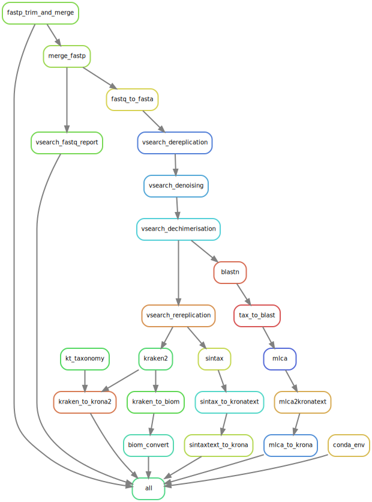

# Tapirs

Tapirs is a reproducible modular workflow for the analysis of DNA metabarcoding data.

Tapirs uses the Snakemake workflow manager and is compartmentalised into several modules, all contained in the rules/ directory. Each module performs a step of the workflow.

Each rule is assigned to a Conda environment containing the appropriate packages needed to perform. Using Conda ensures version control and prevents workflow failure through package incompatability.

Tapirs was created by the EvoHull group, the University of Hull, UK

Instructions for installation, setup, and modification are contained within the [Tapirs documentation](documentation/site/index.html)

## DAG overview of a workflow

## Instructions

#### CONDA and Snakemake

First, ensure a version of conda is intalled on your machine. This can be either anaconda or miniconda.
Miniconda is available at: https://docs.conda.io/en/latest/miniconda.html

##### 1. The env-calling way

Activate your base conda environment and intsll snakemake within it.
This can be done with the following command:

$ conda activte base

$ conda install -c bioconda -c conda-forge snakemake

Snakemake must be ran with the --use-conda flag.

##### 2. The global env way

Create and activate the tapirs conda environment.
This can be done with the following command:

$ conda create --file envs/tapirs.yaml

$ conda activate tapirs

Run the workflow from within this environment. The --use-conda flag will not be needed.

### Database setup

#### BLAST
BLAST requires a local custom database for the workflow to run efficiently.
######## GS or DL - can you put a little bit in here about making blast databases etc - Mike ####

#### KRONA
Krona requires that its taxonomy database is updated/created
To do this, run the following commands, making sure you are within the Tapirs/ directory and the 'tapirs' conda environment.

$ mkdir data/databases/krona/

$ ktUpdateTaxonomy.sh data/databases/krona/

#### KRAKEN
Kraken needs its database to run.
######## GS, cna you sort this out please? - Mike   ########

#### SINTAX
Sintax also needs its own database.

### Input wrangling

The workflow assumes that input data has already been demultiplexed.

Place all library directories within the "data/01_demultiplexed/" directory (or edit path above), ensuring they follow the format "data/01_demultiplexed/<library>/<sample>.<read>.fastq.gz".

### Wildcard generation

<insert command to run script to create tsvs for samples>

$ bash scripts/wildcarding.sh

### Config setup

Open the configuration file "config.yaml" and follow steps there.

Once this file has been configured we are ready to run the workflow.

#### Running the workflow

The workflow can be ran with the following line of code:

$ snakemake -s snakefile --use-conda --printshellcmds -n

The above line will start a dryrun. Assess the joblist of the dryrun and the fnal output files to ensure that your libraries and samples are being detected by the iteration steps.

If all looks well, run the workflow for real with the following code:

$ snakemake -s snakefile --use-conda --printshellcmds

Note: If using environment method 2, the --use-conda flag should not be used.
