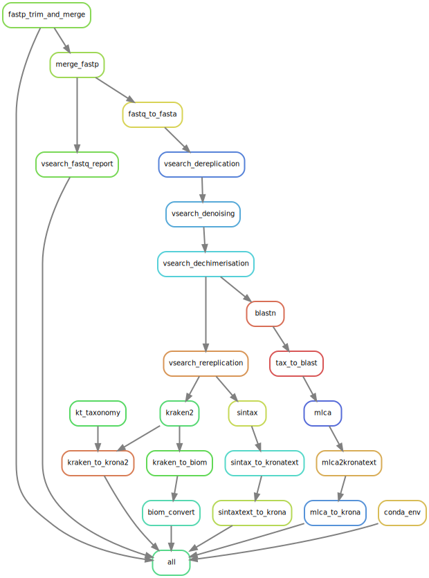

# Tapirs

Tapirs is a reproducible modular workflow for the analysis of DNA metabarcoding data.

Tapirs uses the [Snakemake workflow manager](https://snakemake.github.io/) and is compartmentalised into several modules, each performing a step of the workflow. Tapirs is designed to be experimental, allowing you to test the effect of different approaches to data analysis.

Tapirs was created by the EvoHull group, the University of Hull, UK

Instructions for installation, setup, and modification are contained within the [Tapirs documentation](https://tapirs.readthedocs.io)

## DAG overview of a workflow

One example workflow is illustrated below, you may configure yours differently

## Authors

EvoHull group, University of Hull, UK

* Dave Lunt (@davelunt)
* Graham Sellers (@Graham-Sellers)
* Mike Winter (@mrmrwinter)
* Merideth Freiheit (@merfre)
* Marco Benucci

## Quickstart

Tapirs is curently in 'beta-release', not all features are present and not all bugs have been caught.

Detailed instructions are given in the [Tapirs documentation](https://tapirs.readthedocs.io).

1. install [conda](https://docs.conda.io/projects/conda/en/latest/user-guide/install/) (miniconda)
2. git clone the Tapirs repository, and relocate there
    * `git clone https://github.com/EvoHull/Tapirs`
    * `cd Tapirs`
3. install snakemake
    * `conda install -c conda-forge snakemake`
4. dry run `snakemake -npr` to identify any issues
5. run `snakemake`

## Configure the Tapirs workflow

You should adjust `config/config.yaml` to specify the location of relevant files. These will include any reference databases, taxonomy data, and sequence data to be analysed.

Although sensible defaults have been set you can also specify in `config.yaml` which analysis programs will be used and their parameter settings.

Consult the [Tapirs documentation](https://tapirs.readthedocs.io) to get more extensive support.

----

