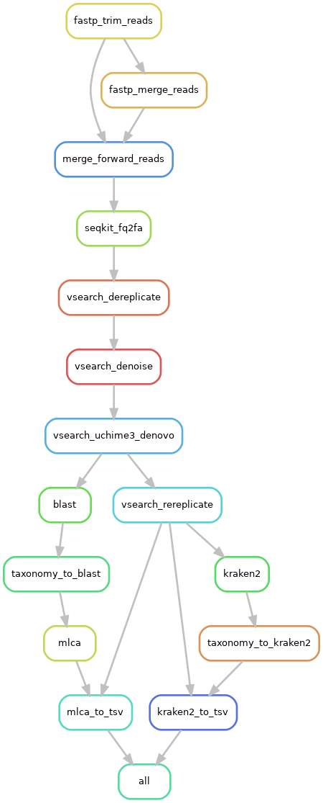

# Tapirs

Tapirs is a reproducible modular workflow for the analysis of DNA metabarcoding data.

Tapirs uses the [Snakemake workflow manager](https://snakemake.github.io/) and is compartmentalised into several modules, each performing a step of the workflow. Tapirs is designed to be experimental, allowing you to test the effect of different approaches to data analysis. Tapirs is curently v1.0, it is simple, robust, and reliable in our hands, but not all features are yet present.

Tapirs was created by the EvoHull group, the University of Hull, UK

Detailed instructions for installation, setup, and modification are contained within the [Tapirs documentation](https://tapirs.readthedocs.io)

## Quickstart

1. install [conda](https://docs.conda.io/projects/conda/en/latest/user-guide/install/) (miniconda)
2. install [git](https://github.com/git-guides/install-git)
3. git clone the Tapirs repository, and relocate there
    * `git clone https://github.com/EvoHull/Tapirs`
    * `cd Tapirs`
4. install snakemake
    * `conda env create -f workflow/envs/env.yaml`
    * `conda activate tapirs`
5. download taxonomy
    * `wget ftp://ftp.ncbi.nih.gov/pub/taxonomy/new_taxdump/new_taxdump.zip`
    * `unzip new_taxdump.zip -d resources/databases/new_taxdump`
    * `rm new_taxdump.zip`
6. populate `resources/databases` with your reference databases and `resources/libraries` with your data (a directory containing your demultiplexed R1/R2.fastq.gz sample files)
7. place your sample sheet tsv in `config/` (see `config/Hull_test.tsv` for layout format)
8. adjust `config/config.yaml` to configure the Tapirs workflow (see below)
9. dry run `snakemake -npr` to identify any issues
10. run `snakemake --cores 4` (you can run all available cores with `snakemake --cores`)

## Configure the Tapirs workflow

You should adjust `config/config.yaml` to specify the location of relevant files (reference databases and sequence data to be analysed) and parameters for the analysis (experiment name, sample sheet name, amplicon/primer lengths, analysis methods etc.). Defaults are present and are set for the test data set: Hull_test.

Consult the [Tapirs documentation](https://tapirs.readthedocs.io) to get more extensive support.

## Workflow overview

One example workflow is illustrated below, you may configure yours differently

## Authors

EvoHull group, University of Hull, UK

* Dave Lunt (@davelunt)
* Graham Sellers (@Graham-Sellers)
* Mike Winter (@mrmrwinter)
* Merideth Freiheit (@merfre)
* Marco Benucci

----

