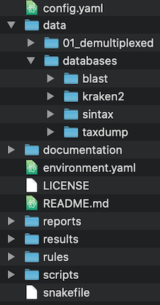

# DIRECTORY STRUCTURE

We set directory structure in the repository to standardise the workflow design.

*Above: the directory structure of a standard Tapirs workflow*
## snakefile
The top level snakefile to control the workflow.
## config file
`config.yaml` is the experiment specific control file. You should edit this to name your experiment, specify the location of data, and edit any variable.
## envs
conda environments for each rule can be specified here. These are in addition to the general top-level environment.yaml and may not be required.
## Data
### raw data
Never analyse your raw data, make a copy to this folder. It then forms part of your experimental record.
### demultiplexed data
We assume your raw data has already been demultiplexed and exists as .fastq.gz format files in a directory specified in the `config.yaml` file. Since de-multiplexing is different in different laboratories we teat this as a separate workflow.
## rules
This contains snakemake workflow description rules for separate tasks. We may have:
- blast.smk
- kraken.smk
- qc.smk
- report.smk

Each of these snakemake rules is run by the main snakefile at the appropriate time. Having separate rules for different sections of the workflow (eg quality control, qc.smk) allows better organisation and simplification of each component within the workflow. In our experience this makes the workflow much more understandable and easier to modify.
## reports
Reports are written by some of the programs. Snakemake will also write a report.
## scripts
Place here scripts called by the snakemake rules
## results
This directory usually has subdirectories named by the program (eg blast). It is a convenient way of organising the output.
## docs
Documentation for Tapirs

# ANALYSIS
## fastp
fastp is used for 2 separate jobs:

1. quality control, filter reads by score and length
2. merge Forward and reverse reads. It additionally does error correction if merged reads have a mismatch, taking the highest quality nucleotide

## vsearch
vsearch does several jobs:

1. conversion of fastq.gz to fasta file format
2. dereplication, removal of identical sequences
3. denoising, removal of sequencing errors
4. chimera removal

The sequences written by vsearch are the query sequences for taxonomic identification.

## blast and BASTA-LCA
### blast
blastn is used to search a pre-prepared database for sequence matches. The hits for each query sequence are written including a taxonomic identifier.

### BASTA
BASTA will determine the Last Common Ancestor (LCA) of the blast hits for each query sequence.

## Kraken2
Kraken2 is an alternative to blast and BASTA-LCA. It uses a k-mer approach to determine taxonomy of query sequences by comparing to a databases built from reference sequences and taxonomic information. Databases are large, and require significant RAM and time to produce and their construction is not part of this workflow. Kraken2 searches themselves however are very fast and efficient.

## graphical display of results
Krona is used to make an interactive html page to display taxonomic summaries
