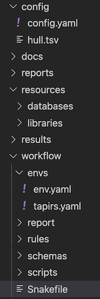

# DIRECTORY STRUCTURE

We set directory structure in the repository to standardise the workflow design. You will need to populate the `resources/libraries` directory with your demultiplexed sequence (fastq.gz) files and the `resources/databases` dirrectory with the reference databases you wish to search them against (eg blast, kraken2).

*Above: the directory structure of a Tapirs workflow* This follows the official [Snakemake cookiecutter workflow](https://github.com/snakemake-workflows/cookiecutter-snakemake-workflow) design.

## Snakefile

The top level snakefile to control the workflow.

## config

`config.yaml` is the experiment specific control file. You should edit this to name your experiment, specify the location of data, and edit any variable.

## resources

We treat the resources directory as read-only during operation of the workflow. It is the location for you to place sequences, and databases, and taxonomy, but the workflow will not write here.

### libraries

We assume your raw data has already been demultiplexed and exists as .fastq.gz format files in a directory specified in the `config.yaml` file. Since de-multiplexing is different in different laboratories we treat this as a separate workflow.

### databases

The databases required will depend on the type of analyses to be carried out. At present we recommend DNA databases for blast, kraken and sintax. You will also need taxonomy information (often called new_taxdump) which is downloaded from the NCBI.

## docs

This contains the documentation for Tapirs, built with [mkdocs](https://www.mkdocs.org/).

## reports

Here we write textual reports from the analyses

## workflow

## workflow/envs

conda environments for each rule can be specified here. These are in addition to the general top-level environment.yaml and may not be required.

### workflow/rules

This contains snakemake workflow description rules for separate tasks. We may have:

- blast.smk
- kraken2.smk
- qc.smk
- reports.smk

Each of these snakemake rules is run by the main snakefile at the appropriate time. Having separate rules for different sections of the workflow (eg quality control, qc.smk) allows better organisation and simplification of each component within the workflow. In our experience this makes the workflow much more understandable and easier to modify. You can usually deactivate a rule by commenting out its `include rules/name.smk` line in the top level snakefile. You may also have to comment out its outputs from rule All.

## workflow/scripts

Scripts called by snakemake rules are placed here.

## results

This directory usually has subdirectories named by program (eg blast). It is a convenient way of organising the output.

# ANALYSIS

## fastp

fastp is used for 2 separate jobs:

1. quality control, filter reads by score and length
2. merge Forward and Reverse reads. It additionally does error correction if merged reads have a mismatch, taking the highest quality nucleotide

## vsearch

vsearch does several jobs:

1. conversion of fastq.gz to fasta file format
2. dereplication, removal of identical sequences
3. denoising, removal of sequencing errors
4. chimera removal
5. rereplication, tracing consensus sequences back to original reads

The sequences written by vsearch are the query sequences for taxonomic identification.

## blast and MLCA

### blast

blastn is used to search a pre-prepared database for sequence matches. The hits for each query sequence are written including a taxonomic identifier.

### MLCA

MLCA (Majority Lowest Common Ancestor) will determine the LCA of the blast hits for each query sequence. It has several options for customising your blast analysis. Majority means that it differs from other LCA scripts in that it can determine LCA from the majority rather than all the hits. Imagine a situation in which 9/10 high quality blast hits for a sequence are to the brine shrimp _Artemia franciscana_ and one is to the Zebra fish _Danio rerio_ (commonly fed on Artemia in the lab). If the LCA looks for the taxonomy shared by **ALL** the top 10 hits (including the likely misclassified Danio record) the LCA is Bilateria and almost all information is lost. If however we decide to set the majority parameter -m to 0.8 then the LCA will determine the taxonomy shared by 80% of the top hits, which will be _Artemia franciscana_. If you set -m to 1.0 then it will require 100% agreement, as other LCAs do. We find this flexibility useful.

## Kraken2

Kraken2 is an alternative to blast and LCA. It uses a k-mer approach to determine taxonomy of query sequences by comparing to a databases built from reference sequences and taxonomic information. Databases are large, and require significant RAM and time to produce and their construction is not part of this workflow. Kraken2 searches themselves however are very fast and efficient.
