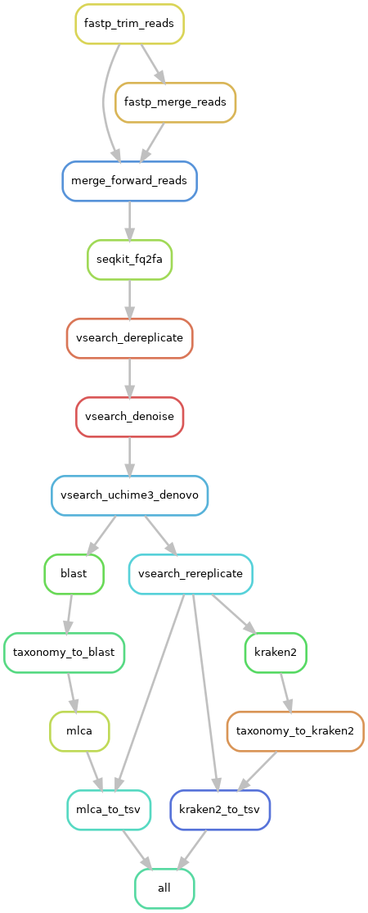

# Overview of Tapirs

Tapirs is a [Snakemake](snakemake.readthedocs.io) workflow system to reproducibly process metabarcode DNA sequences and assign taxonomy. We have designed it to be experimental and extensible. This means that you can evaluate the experimental evidence for taxonomic assignment, modifying parameters, and also incorporate new software packages yourself.

Tapirs is CC0 public domain software hosted at https://github.com/EvoHull/Tapirs

There are three key sections to the Tapirs workflow:

1. **Quality Control** quality trimming, length trimming, denoising to remove errors, and dereplication to remove redundancy
2. **Taxonomic Assignment** Taxonomic identity can be assigned to each sequence by a variety of methods. Currently impleneted are blast with different LCA approaches, and Kraken2 kmer analysis. Since we use a workflow manager (Snakemake) methods can easily be added to this list without affecting the rest of the workflow
3. **Reports and Reproducibility** The workflow will write reports of its analyses and actions, and make reproducibility easy by recording the software environment, making analyses and configurqation explicit, writing output to standard format BIOM and .tsv files.

# Quickstart (if you don't want to read the docs)

1. install [conda](https://docs.conda.io/projects/conda/en/latest/user-guide/install/) (miniconda)
2. git clone the Tapirs repository
    - `git clone https://github.com/EvoHull/Tapirs`
    - `cd Tapirs`
3. install snakemake in your conda environment
    - `conda install -c bioconda -c conda-forge snakemake`
4. Populate `resources/databases` and `resources/libraries` with your data (.fastq.gz) and reference databases
5. Run the script to create the library and sample lists from your data, then check them.
`python /workflow/scripts/get_files_dirs.py`
5. dry run `snakemake -npr` to identify any issues
6. run `snakemake --cores 4` (you can run any number of cores)

See the [installation](Setting-up-Tapirs/installation.md) and [setup](Setting-up-Tapirs/setup.md) pages for more detailed help

## Licence and citation

Project led by [Dave Lunt](https://davelunt.net), Michael Winter, Graham Sellers, Marco Benucci, Merideth Freiheit and the EvoHull group at the University of Hull, UK.

The software is released as CC0, public domain, you may do as you wish.

Please cite the software like this:
```
Title:  Tapirs: extensible reproducible workflows for metabarcoding
URL:    https://github.com/EvoHull/Tapirs
```

**Please also cite the software generating the analyses.** An appropriate way to do this would be: "A reproducible metabarcoding workflow was implemented in Tapirs [1] using vsearch [2], blast [3] and Kraken2 [4]"

### A graph of a typical Tapirs workflow
As part of its report-writing Tapirs will create a DAG illustration of its workflow.


