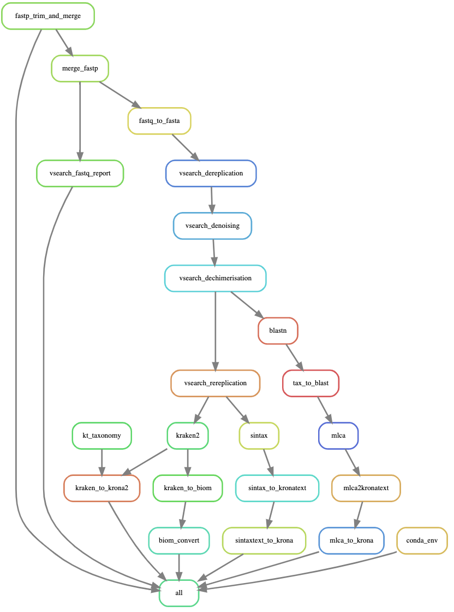

# Overview of Tapirs

Tapirs is a [Snakemake](snakemake.readthedocs.io) workflow system to reproducibly process metabarcode DNA sequences and assign taxonomy. We have designed it to be experimental and extensible. This means that you can evaluate the experimental evidence for taxonomic assignment, modifying parameters, and also incorporate new software packages yourself.

The Tapirs workflow starts with a directory of demultiplexed fastq.gz sequences. There are three key sections to its workflow:

1. **Quality Control** quality trimming, length trimming, denoising to remove errors, and dereplication to remove redundancy
2. **Taxonomic Assignment** Taxonomic identity is assigned to each sequence by a variety of methods including blast with different LCA approaches, SINTAX kmer analysis, and Kraken2. Since we use a workflow manager (Snakemake) methods can easily be added to this list without affecting the rest of the workflow
3. **Reports and Graphical Display** The workflow will write a detailed report of its analyses and actions, and output to standard format BIOM and .tsv files. Krona is used to create interactive html graphical displays of the data. The Vegan R package is used to calculate diversity statistics and plots.

# Quickstart

1. install [conda](https://docs.conda.io/projects/conda/en/latest/user-guide/install/) (miniconda)
2. git clone the Tapirs repository
    - `git clone https://github.com/davelunt/Tapirs`
3. install snakemake in your base conda environment
    - `conda activate base`
    - `conda install -c bioconda -c conda-forge snakemake`
4. Place all library directories within the "data/01_demultiplexed/" directory ensuring they follow the format:
`data/01_demultiplexed/<library>/<sample>.<read>.fastq.gz`
5. Run the script to create the library and sample lists from your data.
`bash scripts/wildcarding.sh`
5. dry run `snakemake -s snakefile --use-conda --printshellcmds -n` to identify any issues
6. run `snakemake -s snakefile --use-conda --printshellcmds`

See the [installation](How-To-Guide/installation.md) and [setup](How-To-Guide/setup.md) pages for more detailed help

# Licence and citation

Project led by [Dave Lunt](https://davelunt.net), Michael Winter, Graham Sellers, Marco Benucci, and the EvoHull group at the University of Hull, UK.

The software is released as CC0, public domain, you may do as you wish.

Please cite the software like this:
```
Title:  Tapirs: extensible reproducible workflows for metabarcoding
Authors:
doi:    1234567
URL:    https://github.com/EvoHull/Tapirs
```

**Please also cite the software generating the analyses.** An appropriate way to do this would be: "A reproducible metabarcoding workflow was implemented in Tapirs [1] using vsearch [2], blast [3], Kraken2 [4], and Krona [5]."

### A graph of a typical Tapirs workflow
As part of its report-writing Tapirs will create a DAG illustration of its workflow.

