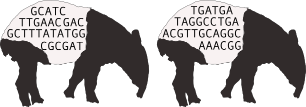

# Overview of Tapirs

Tapirs is a snakemake workflow system to process metabarcode DNA sequences and assign taxonomy.



The Tapirs workflow takes a directory of demultiplexed fastq.gz sequences and applies quality trimming, length trimming, denoising to remove errors, and dereplication to remove redundancy. It will next assign a taxonomic identity to each sequence by a variety of methods. Since we use a workflow manager (snakemake) methods can easily be added to this list without affecting the rest of the workflow. Out of the box it can use:

- blast with Last Common Ancestor analysis of results
- kraken2

The workflow will write reports of its analyses and actions, and output to standard format BIOM and tsv files.

!!! note
    The assumption is that you are working on a POSIX system, not MS Windows.

# Quickstart

1. install [conda](https://docs.conda.io/projects/conda/en/latest/user-guide/install/) (miniconda)
2. git clone the Tapirs repository
    - `git clone url`
3. create and activate a conda environment from the Tapirs `environment.yaml` file
    - `conda env create --file environment.yaml`
4. edit the `config.yaml` to identify the location of demultiplexed data and databases
5. dry run `snakemake -npr` to identify any issues
6. run `snakemake`

See the [installation](How-To-Guide/installation.md) and [setup](How-To-Guide/setup.md) pages for more detailed help

# License and citation

Project led by [Dave Lunt](https://davelunt.net), Mike Winter, Graham Sellers, Marco Benucci, and the EvoHull group at the University of Hull, UK.

The software is released as CC0, public domain, you may do as you wish.

Please cite the software like this:
```
Tapirs: extensible reproducible workflows for metabarcoding
Authors
doi: 1234567
```
